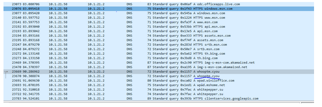
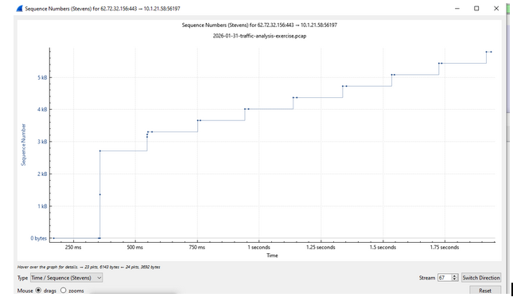

# CASE_STUDY: Malware Traffic Analysis - LUMMA IN THE ROOM-AH 

Tools used: Wireshark

Right away looking deeper into the POST request, the hypertext transfer protocol reveals the attacker host name is: whitepepper.su.

Following the identification of the whitepepper.su C2 domain, an investigation was launched to determine the initial ingress vector and the timeline of the network infiltration.

## Initial Analysis 
Initial protocol-based filtering for common artifact extensions (.exe, .zip, .js) yielded null results. Further inspection of the session handshake confirmed the use of TLS 1.3 cryptographic encapsulation, indicating the payload was delivered via an encrypted tunnel to bypass signature-based detection.

This necessitated a pivot to traffic flow analysis to verify active communication between the external infrastructure and the internal host. Subsequent inspection confirmed a successful payload delivery event.

While on the hunt digging for more information, I found that the payload was indeed encrypted using the TLSv1.3 protocol which is one of the most powerful encryption methods. 

This led me to my next check which was analyzing the DNS protocol. Before even touching the malware, the victim's PC needs to know which server it is communicating with in order to download the malicious program. 

Using the “dns.flags.response == 0 && ip.src == 10.1.21.58 && frame.time_relative > 60 && frame.time_relative < 95” filter allowed me to go on a deep analysis looking for any suspicious sites the victim may have gone on before the DNS came into contact with the attacker host whitepepper.su. 

## The Redirect 
Reputation analysis of the .cyou TLD revealed a high correlation with historical malicious activity. Using targeted DNS response filters, I identified the specific IP address (62.72.32.156) associated with the initial threat actor contact.

## What was being sent?
One of the big questions is what was being sent by whooptm.cyou?
We apply http.host == "whooptm.cyou" || http.host == "whitepepper.su" to the filter to see the actual web request. 

Initial host-based filtering returned null results; however, pivoting to DNS response analysis successfully isolated the attacker's primary IP infrastructure (62.72.32.156).

Fortunately we can use the filter “dns.resp.name == "whooptm.cyou". This will hide everything except the ip address of whooptm.cyou. Resulting in, 

Which gives us the address of the first contact by the attacker. 

## Learning more about the Encrypted Payload
While digging deeper into the traffic between the attacker and the victim, I identifed what could possibly be the malicious content (which could be files or a .exe being sent over). If you look at the image below, it shows the length of both of the traffic being sent for packet #23677 and #23678 being the same, 1410 which is the size of a full sized packet. 

Using this same method I can calculate the size of the files or .exe that was being sent over to the victims network. Or another way that some might find more efficient is using the tcp trace graph. In the screen shot below we can see that after selecting packet 23677 as the initial beginning of the malware transfer and then opening the tcp trace graph we can tell that this was just the initial drop. Meaning the start of the transfer over not the end. 

We can tell this by how small the payload is, it's only roughly 6kb. This is more likely the stage one dropper. After this analysis I could further assume that this was designed to evade basic signature-based detection before establishing a C2 channel.

While the payload volume initially appeared negligible, a comparative analysis of the sequence numbers confirmed a deliberate, low-signal transfer designed to minimize the network footprintThese packets carried some sort of encrypted malware that we can't see the contents off simply based on just the pcap. 

Since the whole payload is just about 6kb we can interpret this as the actual malware was not a full fledged ransomware or something else to that regard either since it was so small. If anything it could have just been some simple drop to get in and then communicate to whitepepper.su that they are ready to receive what we could assume would then be the actual malware. 

I used ip.src == 10.1.21.58 && (tcp.port == 445 || tcp.port == 3389 || tcp.port == 22) 
as a filter to confirm that this was indeed an isolated incident and it did not spread to any other networks. The result of which was indeed it was isolated and contained only to the victims network. Initial assessment of the 6 KB payload suggested a standard dropper; however, extended forensic analysis revealed a sophisticated reconnaissance module. This illustrates the importance of multi-stage traffic reconstruction—looking beyond the initial delivery to understand the full scope of the C2 (Command & Control) lifecycle".

The objective of the next phase is to quantify the payload volume, determine the adversarial intent, and verify if data exfiltration had occurred during the session
After identifying the post request from whitepepper.su, I was able to follow the HTTP steam and view the actual payload being dropped into the c2 steam from before and then I can even see the information being sent back to whitepepper.su that the payload was extracting. 

## Static code analysis 
By performing Static Code Analysis on the extracted JavaScript, I mapped the attacker's execution logic. I identified specific browser fingerprinting techniques, including hardware concurrency checks and WebGL renderer identification, used to distinguish real victim machines from research sandboxes.

Above we can see that the malware was building a sort of profile using the object called navigator. 

The size of the malware itself is only 7kb so definitely not a large complex malware. It seems like it was used just to collect information about the victims machine. 

## Cyber Kill Chain phases
1. Delivery/Exploitation: Identified the DNS redirect to whooptm.cyou.
2. Installation: Isolated the 6 KB encrypted payload delivery via TLS 1.3.
3. Command & Control: Deconstructed the cleartext HTTP beacons to whitepepper.su.
4. Actions on Objectives: Decoded the exfiltration of host hardware fingerprints and browser metadata.

